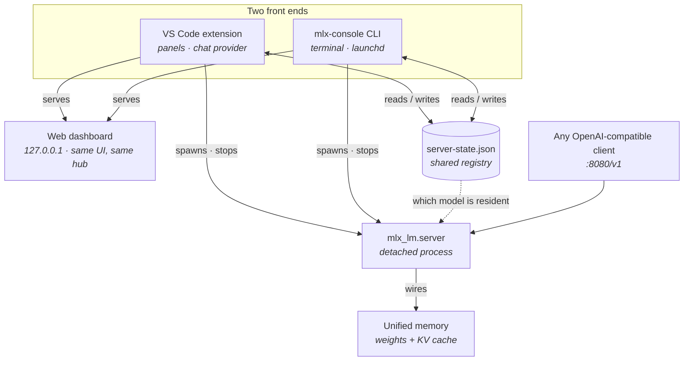
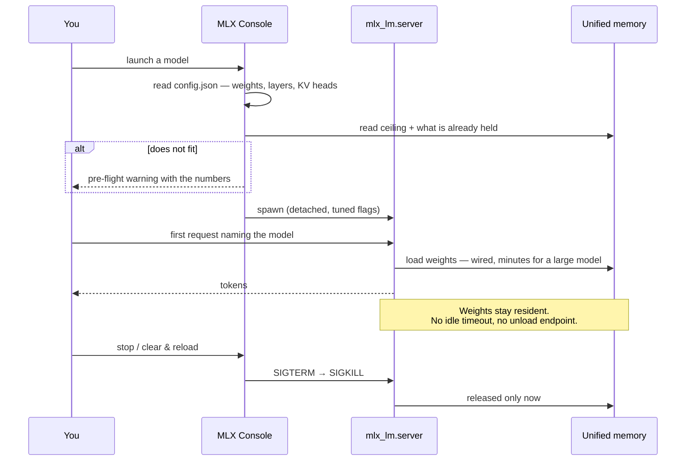
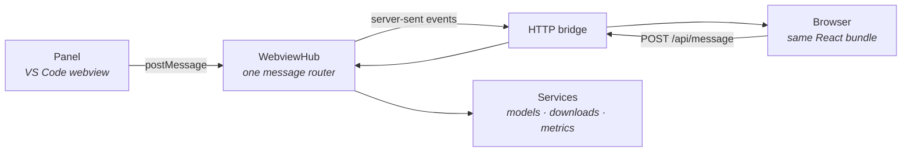

# MLX Console

**Run large language models locally on your Mac — and see what they actually cost.**

MLX Console is a front end for [mlx-lm](https://github.com/ml-explore/mlx-lm)'s inference
server. It starts and supervises `mlx_lm.server`, manages the models that server loads, and
tells you honestly what those models cost in memory — before they take your machine down
with them.

If you have used mlx-lm from the terminal, you know the loop: one window running the server,
another for `huggingface-cli`, a browser tab open on the Hub trying to work out whether a
120B model will actually fit in 128 GB. This collapses that into one panel.

---

## Two packages, one system

The same core ships two ways — plus the **desktop app**, which wraps the headless daemon in
a Chromium window and is the primary way to run MLX Console (see [Install](#install)). Pick
any, or run several — they cooperate rather than compete: whichever starts the server, the
others adopt it.

| | **VS Code extension** (`.vsix`) | **Headless daemon** (`mlx-console`) |
| --- | --- | --- |
| **You get** | Activity-bar panels + the chat provider and `@mlx` participant | The same UI in a browser, plus terminal commands |
| **Needs** | VS Code 1.125+ running | Nothing but Node and a venv with mlx-lm |
| **Interface** | Native panels, or the same UI in a browser (on by default) | The same UI + `status` / `start` / `stop` |
| **Dashboard auth** | Cross-site refused; token optional | Same |
| **Runs at login** | No — dies with the editor | Yes, via launchd |
| **Settings** | VS Code settings (`mlxConsole.*`) | `~/.mlx-console/config.json` |

> [!NOTE]
> Both are built from this one repo. `npm run vsce:package` produces the `.vsix`; the CLI is
> bundled inside it as `dist/cli.js` and also runs straight from a clone.

### How it fits together



There is only ever **one server process**. Whichever side starts it, the other adopts it —
the registry file is how a second VS Code window, or the CLI, learns what is already
resident. `/v1/models` cannot tell you that: it reports your download cache.

---

## Why this exists

On a PC with a discrete GPU there are two memory pools: the model sits in VRAM, the OS in
system RAM, and they do not compete. Apple Silicon has **one pool**. That is why a Mac can
run models no consumer GPU could hold — but it also means the model and macOS draw from the
same budget, and GPU memory is *wired*, so the system cannot page it out to make room.

> [!WARNING]
> A model that is slightly too big does not fail to load. It loads, takes memory the system
> needed, and everything else starts swapping.

Most tooling is quiet about the things that decide whether that happens:

- **Your usable ceiling is not your RAM size.** Metal publishes a
  `max_recommended_working_set_size` — typically well under total memory. It is reported per
  machine, so it can be read rather than approximated with a 70%-of-RAM rule of thumb.
- **The OS has already spent some of it.** Whatever your desktop, browser and editor are
  holding is unavailable, and it is rarely a small number.
- **KV cache scales with context and is not in the model's file size.** Cost per token
  follows from the attention shape — layers, KV heads, head dimension — so a long context can
  add many gigabytes on top of the weights. Grouped-query models cache far less than their
  attention-head count suggests, which is easy to get wrong in the expensive direction.
- **`mlx_lm.server` never unloads.** One model, loaded lazily inside the first request that
  names it, no idle timeout, no unload endpoint.
- **Its defaults target a shared inference host,** not a laptop also running your desktop:
  many parallel decode sequences, each with its own KV cache, and an unbounded prompt cache.

None of these are fixed numbers, which is the point — they depend on your hardware, your
model and what else is running. Everything here is read live rather than assumed, and is
explicit about the one thing it cannot know: macOS exposes no per-process GPU memory
accounting at any privilege level, so "held by other apps" is inferred, not measured.

### What happens when you launch a model



> [!TIP]
> **Reference machine.** Everything here was developed and measured on a **128 GB M5 Max**
> running **gpt-oss-120b** — the usable ceiling is 107.5 GB of the 128, the desktop already
> holds ~22 GB before any model loads, and the KV cache costs ~72 KiB per token (9.7 GB at
> its full 131k context). Your figures will differ; that is exactly why these are measured
> rather than hardcoded.

---

## What it does

**Run the server** — start, stop and supervise `mlx_lm.server`. Its OpenAI-compatible
endpoint lives at `http://127.0.0.1:8080/v1` for any client that speaks the protocol.

**Manage models** — search Hugging Face filtered to what mlx-lm can genuinely run (GGUF and
`.bin`-only repos are marked unusable rather than silently failing later), download with
progress, convert to MLX at the best quantization that fits your machine, launch, and delete.

**See the cost** — live CPU, unified memory and GPU utilisation; which model is resident and
how long it took to load; how much headroom is left; and a per-model breakdown of context
window, KV cost per token, weight size and vocabulary, read from the model's own
`config.json`.

**Measure what it costs the machine** — the **Dashboard** view, first in the list, for when
utilisation is not the question. Device, CPU, memory and GPU figures live here, alongside the
GPU ceiling editor and the per-process GPU sampler. It shows the unified-memory budget as one
pool (model / other apps / headroom),
swap and compressor pressure — the difference between a machine working hard and one being
squeezed — what each context length would cost in KV cache against the headroom you actually
have, and a three-minute trend. Per-process GPU attribution is one button away, via `sudo
powermetrics` run in a terminal you can read.

**Configure in place** — every setting is editable from the UI, with sizes in MB/GB rather
than raw bytes. Values the model knows about itself — context window, sampling defaults, max
output tokens — are read from its files, and anything you set explicitly always wins.

**Use it in the editor, if you want** — served models appear in the VS Code model picker and
as the `@mlx` chat participant, forwarding native and MCP tools. That is one client of the
server, not the point of the project.

---

## Install

### The desktop app (primary)

The Chromium-packaged desktop app owns the runtime: on first launch it asks
where to install, then builds everything — Python venv, mlx-lm, model cache,
config, logs — under that one folder. The VS Code extension and the CLI find
it through `~/.mlx-console/app.json` and become clients of the same daemon.

```bash
npm install
npm run app:dev        # run the app from source
npm run app:package    # build release/MLX Console-<version>-arm64.dmg (unsigned)
```

These dev builds are unsigned, so a downloaded DMG is quarantined by
Gatekeeper. Either right-click the app → Open (twice, the first time), or:

```bash
xattr -dr com.apple.quarantine "/Applications/MLX Console.app"
```

Locally built (not downloaded) apps carry no quarantine flag and open
normally. Closing the window leaves the daemon serving the dashboard and the
extension; ⌘Q stops the model servers too (set `app.keepServerOnQuit` in the
install root's `config.json` to leave them running).

### The VS Code extension

No marketplace release yet — coming soon. Until then, build the `.vsix` from source:

```bash
git clone <this-repo>
cd mlx_console_gui
npm install
npm run vsce:package    # README sync + production esbuild + vsce package
```

Then install the packaged extension and reload the window:

```bash
code --install-extension mlx-console-gui-0.0.18.vsix --force
```

Open the **MLX Console** icon in the activity bar afterwards.

How it behaves depends on whether the desktop app is installed (`mlxConsole.mode`,
default `auto`):

- **App onboarded** (its install-root pointer exists) → the extension runs as a **thin
  client**: the panels talk to the app's daemon, and the app owns the venv, models and
  servers. Nothing to set up in the editor.
- **No app** → classic embedded mode, exactly as before: first run offers to set up the
  Python environment inside the extension.

Set `mlxConsole.mode` to `remote` or `embedded` to force either; `mlxConsole.daemonUrl`
points at a daemon that discovery would not find on its own.

<details>
<summary>If <code>code</code> is not on your PATH</summary>

Common when VS Code was installed by dragging it to `/Applications`. Either run
**Shell Command: Install 'code' command in PATH** from the palette, or use the binary inside
the app bundle:

```bash
"/Applications/Visual Studio Code.app/Contents/Resources/app/bin/code" \
  --install-extension mlx-console-gui-0.0.18.vsix --force
```

</details>

### The CLI

The CLI is bundled into the extension as `dist/cli.js`, so installing the extension already
puts it on your machine. From a clone, `npm link` gives you the command directly:

```bash
npm link           # provides `mlx-console`
```

Otherwise alias the copy inside the installed extension:

```bash
alias mlx-console='node ~/.vscode/extensions/mlx-console.mlx-console-gui-*/dist/cli.js'
```

It finds the environment the extension already built — including Cursor's and VSCodium's,
which keep their own user directories. If you have never run the extension, point `venvPath`
in `~/.mlx-console/config.json` at a virtualenv that has mlx-lm in it.

### Requirements

- **macOS on Apple Silicon (arm64).** Checked at startup — MLX is Apple-only.
- **Python 3.** A virtual environment is created and managed for you; nothing is installed
  globally.
- **VS Code 1.125+** for the extension (the language model chat provider API). The CLI needs
  only Node 18+.
- **Disk.** Models are large; a 120B model at 4-bit is around 60 GB.

---

## The web dashboard

With VS Code running, the dashboard **is** the panel — the same React app, served to your
browser and bridged to the same message hub. Hugging Face search, downloads with progress,
conversion, the model list, metrics and every setting: not a reimplementation that slowly
falls behind, but the same code with a different transport.



Tabs across the top switch view; each is a page load that mounts the same component the
corresponding panel does.

**From the extension** — it is **on by default**, at a plain, bookmarkable address:

```
http://127.0.0.1:8090
```

No token, no query string. **MLX: Open Web Dashboard (local)** opens it, and **MLX: Copy Web
Dashboard URL (local)** puts it on the clipboard, but you can equally just type it.

Each VS Code window serves its own dashboard: the first takes port 8090, the rest quietly
take an OS-assigned port — which is when the command is genuinely easier than guessing. Set
`webUi.enabled` to false to turn it off.

**From the CLI** — `mlx-console serve` needs no editor at all, and serves the *same* UI. Hub
search, downloads, conversion, models, metrics, settings: the daemon constructs the same
services the extension does, and the same hub routes them. It shares the extension's storage
too, so it uses the venv the extension built and sees the server it started.

<details>
<summary><b>How a page with no password stays safe</b></summary>

"It only listens on localhost" is not a boundary by itself: any page you have open can POST
to `127.0.0.1`. CORS hides the *response*, but a fire-and-forget request that flips a setting
or stops your server would succeed anyway. What stops it is that the browser says where the
request came from, and the page cannot lie about it:

- **`Sec-Fetch-Site: cross-site` is refused**, as is an `Origin` that is not loopback. This
  is the check that makes a tokenless dashboard defensible — a drive-by request from another
  site carries one or both, and is turned away.
- **`Host` must be loopback**, which blocks DNS rebinding (a remote origin resolving to
  127.0.0.1 still sends its own Host).
- **Writes must be `application/json`** — a content type a cross-origin HTML form physically
  cannot produce, so even a browser too old to send the headers above cannot submit one.
- **Secrets are masked** on the way out, and an unchanged `••••••••` is never written back
  over the real value.
- The page loads **no external fonts, scripts or styles**, so it works offline and leaks
  nothing to a third party.

Set **`webUi.requireToken`** to add a per-session token on top. The case for it is other
people having accounts on the same Mac: a loopback port is reachable by every local user, and
the checks above do not distinguish between them. The URL then becomes
`http://127.0.0.1:8090/?t=…`, handed to you by the command.

</details>

> [!IMPORTANT]
> **This is for your machine only.** The listener binds to `127.0.0.1` in code and
> deliberately ignores `server.exposeToLan`. There is no setting that widens it, and it is not
> meant to be put on a network or deployed anywhere. That assumption is exactly what lets it
> run without a password.

---

## Headless mode

The extension host is a convenient place to run this, not a necessary one — everything the
dashboard needs is a process, a settings file and some `ioreg` / `vm_stat` output.

```sh
mlx-console serve                 # the dashboard, no VS Code
mlx-console start | stop | restart
mlx-console stop --all            # every server, including untracked orphans
mlx-console status [--json]       # the terminal version of the metrics panel
mlx-console models [--json]       # local models, scanned from your models directory
mlx-console url                   # the tokenised dashboard link
mlx-console config                # where settings and the venv were found
mlx-console install [--port N]    # run the dashboard at login
mlx-console uninstall
```

```console
$ mlx-console status
server:  ready (pid 4821) on port 8080
model:   mlx-community/gpt-oss-120b-4bit
memory:  62.1 GB held by the server
venv:    …/globalStorage/mlx-console.mlx-console-gui/venv

$ mlx-console models
*    76.9 GB  lmstudio-community/gpt-oss-120b-MLX-8bit

* resident in the running server
```

`models` is not a directory listing. It runs the extension's own Python helper inside your
venv with `HF_HOME` set from `modelsDir`, so `huggingface_hub` reports what the server can
actually load — snapshots, symlinks and partial downloads accounted for. `mlx-console config`
prints the path it will scan, which is worth checking before wondering where a model went.

**They share one server, not two.** The CLI reads the same registry file the extension
writes, so `status` reports the model VS Code loaded and `stop` stops it. Both build the
server command line from the same module, so they cannot start it with different flags.

**Settings are a deliberate exception.** With VS Code closed nothing owns `settings.json` —
and writing to it anyway is a bad trade, since it is JSONC and VS Code rewrites the whole
file on save. The CLI therefore owns `~/.mlx-console/config.json`, seeded once from your VS
Code settings and `0600` because it can hold a Hugging Face token. The two can drift, so
every value in the headless dashboard is tagged `[vscode]`, `[cli]` or `[default]`.

<details>
<summary><b>Running the dashboard at login</b></summary>

`mlx-console install` writes a LaunchAgent to
`~/Library/LaunchAgents/com.mlx-console.daemon.plist` and loads it. It restarts on crash but
**not** after a clean exit, so stopping it deliberately stays stopped. `mlx-console uninstall`
removes it.

Under launchd there is no terminal to print the URL to, and launchd creates its log files
world-readable — so with `webUi.requireToken` on, the daemon deliberately does **not** write
the URL to its log. It goes to `~/.mlx-console/url` at `0600`:

```console
$ mlx-console url
http://127.0.0.1:8090/
```

Note what this does *not* do: it serves the dashboard, it does not load a model at boot.
Weights are only read when the first request naming them arrives. And running at login means
a port listening whenever you are logged in — still `127.0.0.1`, still token-gated, but it is
the one genuinely new exposure here.

</details>

> [!NOTE]
> Closing VS Code does not unload your model. `mlx_lm.server` is spawned detached, in its own
> process group, so it keeps serving after the window that started it closes — which is the
> point, but it also means a crashed or force-quit window can leave one running with nothing
> tracking it. `mlx-console stop --all`, or **MLX: Stop All Servers** in the palette, finds
> those by process rather than by what was remembered. Quitting `mlx-console serve` stops
> them for you; pass `--keep-server` if you would rather it did not.

If you want inference with no editor and no dashboard at all, you do not need any of this:
`mlx_lm.server --model <path-or-hf-id> --port 8080` is the whole requirement. What you give
up is the pre-flight memory check, the live headroom and KV-cost figures, and the model
management.

---

## Configuration

Every setting is editable from the UI — the **Server & Settings** panel, or the web
dashboard. You should not need to open VS Code's settings editor. Sizes accept `8 GB` /
`512 MB`; a bare number means MB.

Most defaults are fine. These are the ones worth understanding:

**`contextWindow`** — leave it unset. Each model's real window is read from its own
`config.json` and shrunk if the KV cache would not fit in the memory you have left. Setting it
yourself overrides both, which is occasionally what you want (forcing a short context to save
memory) and usually not.

**`server.promptCacheBytes`** — `mlx_lm.server` leaves this **unbounded**, trimming only after
10 cached conversations, so it can quietly grow into whatever the model left free. The Metrics
panel computes a recommendation from live headroom; a few GB is plenty.

**`server.decodeConcurrency`** — the server default is 32 parallel sequences, each with its own
KV cache. For a single editor, **1–4** is realistic; the Metrics panel will tell you what your
headroom actually supports.

**`modelsDir`** — where weights land. Point it somewhere with room, preferably outside your
project folder; a 120B model at 4-bit is around 60 GB.

**`sampling.*`** — only set these if you disagree with the model. Anything you leave alone
falls back to the model's own `generation_config.json`, usually tuned better than a global
default. Disabling values (`topK` 0, `minP` 0, `repetitionPenalty` 1) are omitted from
requests entirely rather than pinning a sampler you did not ask for.

**`server.draftModel`** — speculative decoding. The draft must share the target's exact
tokenizer, so candidates are matched on `vocab_size` rather than by name, and its weights load
*in addition* to the main model.

The complete list is at the end: **[Settings reference](#settings-reference)**.

---

## Development

```bash
npm install
npm run watch        # or: npm run compile — builds the extension, the CLI, the webview
                     # and the Electron main/preload bundles
npm run typecheck
npm test             # 233 unit tests, no VS Code host required
npm run app:dev      # compile + launch the desktop app from source
```

Press `F5` to launch an Extension Development Host.

The tests deliberately cover the parts that are easy to get quietly wrong — parsing `vm_stat`
and `ioreg` output, KV-cache arithmetic under grouped-query attention, harmony channel
parsing, the memory estimators, and the dashboard's authorisation rules — rather than the UI
wiring.

<details>
<summary><b>Building a .vsix, and the packaging traps</b></summary>

`npm run vsce:package` syncs this README's version references and settings table from
`package.json`, runs a production esbuild, then `vsce package --no-dependencies`.

```bash
npm version patch --no-git-tag-version   # vsce refuses to overwrite an existing .vsix
npm run typecheck && npm test            # vsce does not run these for you
npm run vsce:package
unzip -l mlx-console-gui-*.vsix       # inspect what actually shipped
```

Each of these cost real time, so they are written down:

- **Keep model weights out of the package.** The default `modelsDir` can sit inside the
  workspace. `models/**` is in `.vscodeignore` because vsce secret-scans every included file
  and dies on multi-GB weights.
- **No repo-relative Markdown links** unless `package.json` has a `repository` field — and
  vsce's link scanner does not respect code spans, so even an example inside backticks trips
  it.
- **Reload the window** after installing; VS Code keeps the old extension host running.
- **Pin `@types/vscode` to the `engines.vscode` floor.** A caret range once resolved to a much
  newer version, so the compiler happily accepted APIs the manifest did not guarantee.

</details>

<details>
<summary><b>Building the desktop app (Electron)</b></summary>

The app is the same daemon the CLI runs — `createDaemon()` in `src/headless/daemon.ts` —
wrapped in a Chromium window pointed at the dashboard it serves. `src/electron/main.ts` is
the only Electron-specific code; everything else is shared.

```bash
npm run app:dev        # compile all bundles, then launch Electron from source
npm run app:package    # production esbuild + electron-builder
                       # → release/MLX Console-<version>-arm64.dmg (and .zip)
```

What to know before it surprises you:

- **`ELECTRON_RUN_AS_NODE` must not be set.** VS Code's integrated terminal sets it, and it
  turns the Electron binary into plain Node — in dev the app crashes on
  `app.requestSingleInstanceLock`, packaged it exits instantly with no output. `app:dev`
  strips it for you; if you launch the binary by hand, prefix with
  `env -u ELECTRON_RUN_AS_NODE`.
- **What ships where** (`electron-builder.yml`): the asar archive holds only the Electron
  entry files. The webview bundle, `dist/cli.js` and `resources/py/` ship as
  `extraResources` under `Contents/Resources/` — Python cannot exec a script that lives
  inside an asar, and `main.ts` hands the daemon absolute paths from
  `process.resourcesPath`.
- **App icon** is `build/icon.png` (gitignored, ≥512 px). Regenerate it from the extension
  icon with `mkdir -p build && sips -z 512 512 resources/icon.png --out build/icon.png`;
  without it electron-builder falls back to the stock Electron icon.
- **Builds are unsigned** (`identity: null`), so downloaded copies hit Gatekeeper — see the
  Install section for the right-click → Open / `xattr` workaround. Locally built apps open
  normally.
- **First run writes `~/.mlx-console/app.json`**, the pointer to the install root the user
  picked. Delete that file to re-run onboarding; delete the root folder itself to start
  completely fresh.
- The `"main"` field in `package.json` stays `dist/extension.js` for vsce;
  electron-builder overrides it to `dist/electron/main.cjs` via `extraMetadata`, so one
  manifest serves both packagers.

</details>

---

## Status

Under active development. The memory, model-management and configuration surfaces are
working; inline completions (FIM), LoRA adapters and KV-cache quantization are not — the last
is blocked upstream, as `mlx_lm.server` exposes no flag for it.

Expect rough edges.

## Contributing

**Please do — especially on hardware that is not mine.** Almost all of the memory logic was
tuned against a single M5 Max, so an M1 Pro with 16 GB reporting something odd is worth more
here than another feature. Models other than gpt-oss are the same story: mis-parsed metadata
is the most likely bug class in this codebase.

Fork it, break it, open an issue for anything surprising — including bad wording or a number
in the Metrics panel that looks wrong. It may well be wrong. Questions and half-formed ideas
are fine in issues; you do not need a patch to start a conversation.

Before a PR:

```bash
npm run typecheck && npm test
```

There is no CI yet, so those two commands are the whole gate. If you change parsing or memory
logic, please add a test — that suite exists because those are exactly the places where a
wrong answer looks plausible.

## Author

Built by **[@bengurion](https://github.com/bengurion)**.

Standing on [mlx](https://github.com/ml-explore/mlx) and
[mlx-lm](https://github.com/ml-explore/mlx-lm) from Apple's machine-learning research group,
and the [Hugging Face Hub](https://huggingface.co) for model distribution. Not affiliated with
Apple or Hugging Face.

## License

[Elastic License 2.0](https://www.elastic.co/licensing/elastic-license) — free to use, copy,
modify and redistribute; what you may not do is offer MLX Console to others as a hosted or
managed service, or strip the licensing from it. The full text is in the `LICENSE` file at
the repository root.

---

## Settings reference

Generated from the extension manifest, so it cannot drift from the real defaults. The same
keys are used by the CLI, without the `mlxConsole.` prefix, in
`~/.mlx-console/config.json`.

<details>
<summary><b>All 34 settings</b></summary>

<!-- settings:start -->

#### General

| Setting | Type | Default | Notes |
| --- | --- | --- | --- |
| `mode` | string | `auto` | Who owns the runtime. 'remote': the MLX Console desktop app does, and this extension is a thin client of its daemon. 'embedded': this extension manages the venv and servers itself, as before. 'auto': remote exactly when the desktop app has completed its first-run setup. |
| `daemonUrl` | string | _(empty)_ | Explicit URL of a running MLX Console daemon (e.g. http://127.0.0.1:8090/?t=…). Leave empty to discover it automatically. |
| `pythonPath` | string | _(empty)_ | Path to a Python 3 interpreter used to create the managed virtual environment. Leave empty to auto-detect. |
| `venvPath` | string | _(empty)_ | Directory for the managed Python virtual environment where mlx-lm is installed. |
| `modelsDir` | string | _(empty)_ | Directory where models are downloaded and cached (sets HF_HOME; models live under <dir>/hub). Shared with mlx_lm.server and the Hugging Face CLI. |
| `defaultModel` | string | _(empty)_ | Default MLX model repo id used for chat when none is selected. |
| `contextWindow` | number | `131072` | Context window advertised to VS Code for MLX models (`maxInputTokens`). |
| `maxOutputTokens` | number | `4096` | Maximum tokens an MLX model may generate in one response. |
| `modelOverrides` | object | `{}` | Per-model generation overrides, keyed by model id (or a converted model's local path). |

#### Server

| Setting | Type | Default | Notes |
| --- | --- | --- | --- |
| `server.host` | string | `127.0.0.1` | Host the mlx_lm.server binds to (ignored when Expose to LAN is on). |
| `server.port` | number | `8080` | Port for mlx_lm.server. |
| `server.autoStart` | boolean | `true` | Start the server automatically when it is first needed. |
| `server.exposeToLan` | boolean | `false` | Bind the server to 0.0.0.0 so other machines/tools can reach it. Security risk on untrusted networks. |
| `server.apiKey` | string | _(empty)_ | Optional bearer token required for served requests (also shown in external-client snippets). |
| `server.extraArgs` | array | `[]` | Extra command-line arguments passed to mlx_lm.server for machine-specific tuning (e.g. context/KV-cache limits, chat template). |
| `server.promptCacheSize` | number | `0` | Maximum number of distinct KV caches held in the prompt cache (mlx_lm.server --prompt-cache-size). 0 uses the server default. |
| `server.promptCacheBytes` | number | `0` | Maximum size of the KV/prompt caches (`mlx_lm.server --prompt-cache-bytes`). Accepts a size such as `8 GB` or `512 MB`; a bare number is read as MB. |
| `server.decodeConcurrency` | number | `0` | Sequences decoded in parallel (`mlx_lm.server --decode-concurrency`). |
| `server.promptConcurrency` | number | `0` | Prompts prefilled in parallel (`mlx_lm.server --prompt-concurrency`). Server default 8. |
| `server.prefillStepSize` | number | `0` | Tokens per prefill step (`mlx_lm.server --prefill-step-size`). Server default 2048. |
| `server.draftModel` | string | _(empty)_ | Small model used for speculative decoding (`mlx_lm.server --draft-model`). |
| `server.numDraftTokens` | number | `0` | Tokens proposed per speculation step (`mlx_lm.server --num-draft-tokens`). Server default 3. |

#### Sampling

| Setting | Type | Default | Notes |
| --- | --- | --- | --- |
| `sampling.temperature` | number | `0.7` | Sampling temperature. Lower is more deterministic (good for code). |
| `sampling.topP` | number | `1` | Nucleus sampling top-p. 1.0 disables it. |
| `sampling.topK` | number | `0` | Top-k sampling. 0 disables it. |
| `sampling.minP` | number | `0` | Min-p sampling. 0 disables it. |
| `sampling.repetitionPenalty` | number | `1` | Repetition penalty. 1.0 disables it. |
| `sampling.maxTokens` | number | `2048` | Maximum tokens generated per response. |

#### Hugging Face

| Setting | Type | Default | Notes |
| --- | --- | --- | --- |
| `huggingFace.token` | string | _(empty)_ | Optional Hugging Face token for higher rate limits and gated models. |

#### Local dashboard

| Setting | Type | Default | Notes |
| --- | --- | --- | --- |
| `webUi.enabled` | boolean | `true` | Serve an editable dashboard on `http://127.0.0.1`. Loopback only — it ignores Expose to LAN and cannot be reached from another machine. |
| `webUi.requireToken` | boolean | `false` | Require a per-session token in the dashboard URL. |
| `webUi.port` | number | `8090` | Port for the local dashboard. Use 0 to let the OS pick a free one. A second VS Code window takes an OS-assigned port automatically rather than failing. |

#### cleanEndpoint

| Setting | Type | Default | Notes |
| --- | --- | --- | --- |
| `cleanEndpoint.enabled` | boolean | `false` | Serve a second OpenAI endpoint that strips the harmony format gpt-oss models emit. |
| `cleanEndpoint.port` | number | `8082` | Port for the filtered endpoint. Use 0 to let the OS pick a free one. |

<!-- settings:end -->

</details>
